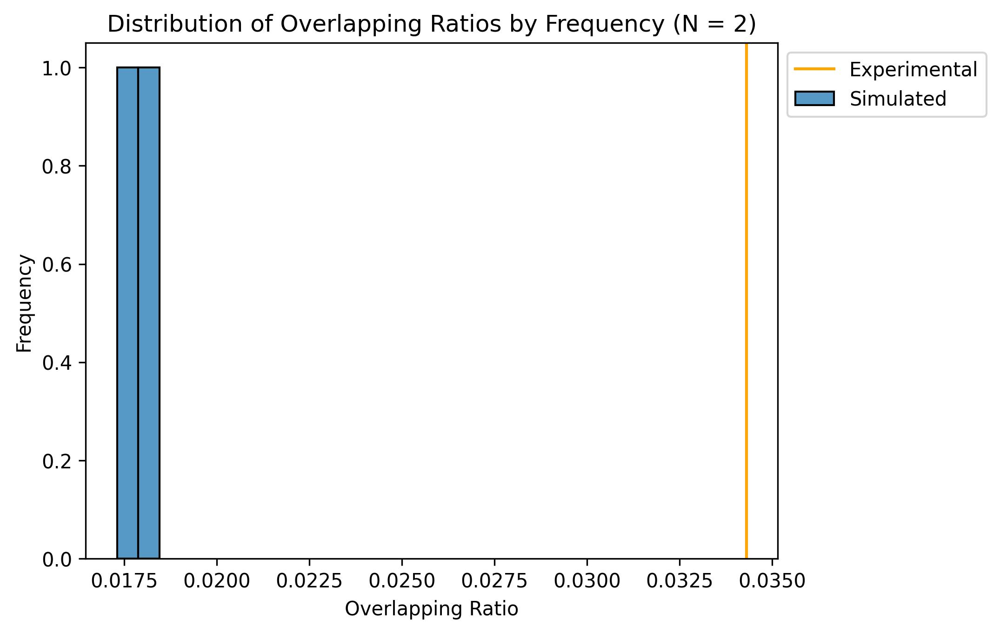

# LoopSim

## TODO:

- [x] complete pipeline
- [?] improve performance (may be as good as can get on python -- probably just move to SLURM)

## Installation

```shell
git clone https://github.com/CutaneousBioinf/hi-c
cd hi-c
python3 -m pip install .
```

You may receive a warning that is something like `The script loopsim is not on PATH`. You have two options to resolve this. 

- Option one: add the directory with the LoopSim entry point to your `$PATH` environment variable. 
- Option two: invoke LoopSim with `python3 -m loopsim` as opposed to just `loopsim`.

## Using the pipeline

LoopSim is brokeen down into a number of different commands, which are designed to be chained.

The process should look something like this:

1. `loopsim validate` - This step validates the input data and possibly removes any erroneous data.
2. `loopsim simulate` - This produces a distribution of simulated loop files. Note that this may be a very intensive task, depending on the number of simulations you require. I recommend that anything >30 simulations be done with multiple batches, possibly as a collection of SLURM jobs.
3. `loopsim analyze` / `loopsim bulk-analyze` - Use `bulk-analyze` to produce summary tables with overlaps for the simulated distribution of loop files. Use `analyze` to do the same for single loop files, such as the original.
4. `loopsim visualize` - Use this to produce visualizations, summary statistics, and to perform a statistical test on the simulated distribution and the original loop file.

## CLI

You can run `loopsim --help` for a broad overview of each of the commands.

```shell
$ loopsim --help
Usage: python -m loopsim [OPTIONS] COMMAND [ARGS]...

  For more explanation of what every command does, please see the
  documentation.

Options:
  --delimiter TEXT  delimiter for outputted files [default: tab]
  --help            Show this message and exit.

Commands:
  analyze       Perform analysis on a single loop file
  bulk-analyze  Perform analysis on a distribution of loop files
  simulate      Generate a distribution of simulations.
  validate      Validate input file and output a validated version.
  visualize     Get visualization and stats from distribution of ratios...
```

You can also run `loopsim <COMMAND> --help` for more detailed help messages on each of the commands.

For example, here is the help message for `simulate`:

```shell
$ loopsim simulate --help
Usage: python -m loopsim simulate [OPTIONS] LOOP_IN_FILE
                                  CHROMOSOME_REGION_FILE
                                  SIMULATION_DATA_DIRECTORY

  Generate a distribution of simulations.

  NOTE: any data in SIMULATION_DATA_DIRECTORY may be overwritten!!

Options:
  --num-sims INTEGER       number of simulations  [default: 1]
  --num-processes INTEGER  number of threads to use
                           [default: round(multiprocessing.cpu_count() / 2)]
  --help                   Show this message and exit.
```

## Demo

### Validate

```shell
$ loopsim validate data/merged_5K_10K.loop loop_valid.loop data/chr_region_hg19
Input loop file: data/merged_5K_10K.loop
Output loop file: loop_valid.loop
Chromosome regions file: data/chr_region_hg19
Flagging loop ends that are >= 1.000000e+05
Delimiter for output: ' '
Validating loop data
Validation complete
Validated data outputted to file loop_valid.loop
```

Files after:

```
.
└── loop_out.loop
```

### Simulate

```shell
$ loopsim simulate --num-sims 2 loop_valid.loop data/chr_region_hg19 sims/
Input loop file: loop_valid.loop
Chromosome regions file: data/chr_region_hg19
Number of simulations: 2
Number of processes: 5
Outputting simulation files to directory: sims/
Delimiter for output: ' '
Simulation 0 simulation started
Simulation 1 simulation started
Simulation 0 simulation complete
Simulation 1 simulation complete
Simulation 0 data outputted to file: sims/sim_hi-c_0.loop
Simulation 1 data outputted to file: sims/sim_hi-c_1.loop
```

Files after:

```
.
└── sims
    |── sim_hi-c_0.loop
    └── sim_hi-c_1.loop
```

### Analyze

**Bulk analysis:**

```shell
$ loopsim bulk-analyze sims/ data/95_BCS_psor_loci ratios_out.txt --loop-out-directory loop_out_dir/
Input loop files directory: sims/
Intervals file: data/95_BCS_psor_loci
Ratio distribution file: ratios_out.txt
Delimiter for output: ' '
Output loop files directory: loop_out_dir/
Output directory does not exist.
Output directory created!
Finished outputting analyzed files to loop_out_dir/
Finished outputting ratio distribution to ratios_out.txt
```

Files after:

```
.
|── ratios_out.txt
└── loop_out_dir
    |── summary_table_0.loop
    └── summary_table_1.loop
```

**Analysis of the original file (validated):**

```shell
$ loopsim analyze loop_valid.loop loop_analyzed.loop data/95_BCS_psor_loci
Input loop file: loop_valid.loop
Output loop file: loop_analyzed.loop
Intervals file: data/95_BCS_psor_loci
Delimiter for output: ' '
Outputted analyzed loop file to loop_analyzed.loop
Ratio of overlapping intervals out of the total number of loops was: 0.034299968818210166
```

Files after (though we don't use `loop_analyzed.loop` in the pipeline again):

```
.
└── loop_analyzed.loop
```

## Visualize

```
$ loopsim visualize ratios_out.txt dist_plot.jpg --other 0.034299968818210166
Obtaining overlapping ratios from: ratios_out.txt.
Exported plot to dist_plot.jpg

Summary stats:
Distribution mean: 0.0178775595052489
Distribution std: 0.000808458018194828
Distribution min: 0.0173058933582787
Distribution median: 0.0178775595052489
Distribution max: 0.0184492256522191

Calculating p-value based on empirical distribution:
p-value: 0.0

Calculating p-value based on normal distribution:
p-value: 0.0
```

Note: $p = 0$ is probably an artifact of the simulation being $N = 2$.

