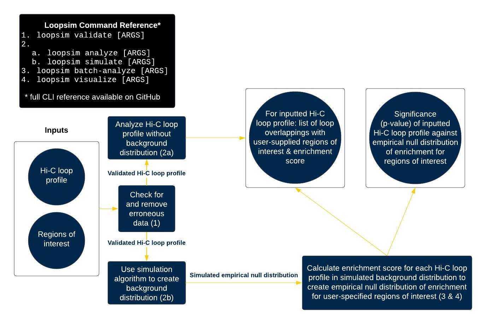

# Loopsim

- [Requirements](#requirements)
- [Installation](#installation)
  - [With Pip](#with-pip)
  - [From GitHub](#from-github)
  - [From source](#from-source)
- [Input Files Format](#input-files-format)
- [Basic Usage](#basic-usage)
- [CLI Reference](#cli-reference)
- [Tutorial](#tutorial)
  1. [Validation](#validation)
  2. [Simulation](#simulation)
  3. [Analysis](#analysis)
     - [Batch Analysis](#batch-analysis)
     - [Single-file Analysis](#single-file-analysis)
  4. [Visualization](#visualization)

## Requirements

Loopsim was tested with the following environment:

- Python >=3.8
- Linux (Ubuntu 20.04 LTS)

## Installation

### With Pip

```shell
pip install loopsim
```

### From GitHub

```shell
pip install git+https://github.com/CutaneousBioinf/Loopsim 
```

### From source

```shell
git clone https://github.com/CutaneousBioinf/Loopsim
cd Loopsim

# Option 1: pip
pip install .

# Option 2: poetry
poetry install
```

## Input Files Format

The Loopsim pipeline requires three types of files:

- **Type Name:** Chromatin loop file
  - Purpose: Store chromatin loop (Hi-C) data
  - Format: Delimiter-separated values file. Each row represents one chromatin loop.

    Columns are as follows:

    | Start region chromosome | First loci of start region | Last loci of start region | End region chromosome | First loci of end region | Last loci of end region |
    |:---:|:---:|:---:|:---:|:---:|:---:|

  - Example: [merged_5K_10K.loop](./example_data/merged_5K_10K.loop)

- **Type Name:** Chromosome region file
  - Purpose: ?
  - Format: Delimiter-separated values file. Each row represents one chromosome region.

    Columns are as follows:

    | Chromosome | ? | ? |
    |:---:|:---:|:---:|

  - Example: [chr_region_hg19](./example_data/chr_region_hg19)

- **Type Name:** Genomic regions of interest
  - Purpose: Store genomic regions of interest to be checked against chromatin loop file
  - Format: Delimiter-separated values file. Each row represents a genomic region of interest.

    Columns are as follows:

    | Chromosome | Start loci of region | End loci of region |
    |:---:|:---:|:---:|

  - Example: [95_BCS_psor_loci](./example_data/95_BCS_psor_loci)

## Basic Usage

Loopsim is broken down into a number of different commands:

| Step | Command                                 | Command Description                                                                                                                                                                                                                                                |
|:---------------:|:----------------------------------------------:|--------------------------------------------------------------------------------------------------------------------------------------------------------------------------------------------------------------------------------------------------------------------|
| 1             | `validate`                           | Validates the inputted loop file. Issues warnings about possibly erroneous data and removes some types of erroneous data.                                                                                                                                          |
| 2             | `simulate`                           | Produces a distribution of simulated loop files. Note that this may be a very intensive task, depending on the number of simulations you require. I recommend that anything >30 simulations be done with multiple batches, possibly as a collection of SLURM jobs. |
| 3             | `analyze` or `batch-analyze` | Use `batch-analyze` to produce summary tables with overlaps for the simulated distribution of loop files. Use `analyze` to do the same for single loop files, such as the original.                                                                                |
| 4             | `visualize`                          | Produces visualizations, outputs summary statistics, and performs a statistical test with the simulated distribution and the original loop file.                                                                                                                   |

|  | 
|:--:| 
| Loopsim pipeline with the optional simulated background distribution |

## CLI Reference

You can run `loopsim --help` for a broad overview of each of the commands.

```console
$ loopsim --help
Usage: loopsim [OPTIONS] COMMAND [ARGS]...

  For a more thorough explanation of what every command does, please see the
  documentation.

Options:
  --delimiter TEXT  delimiter for outputted files [default: tab]
  --version         Show the version and exit.
  --help            Show this message and exit.

Commands:
  analyze        Perform analysis on a single loop file
  batch-analyze  Perform analysis on a distribution of loop files
  simulate       Generate a distribution of simulations
  validate       Validate input file and output a validated version
  visualize      Get visualization and stats from distribution of ratios
```

You can also run `loopsim <COMMAND> --help` for more detailed help messages on each of the commands.

For example, here is the help message for `simulate`:

```console
$ loopsim simulate --help
Usage: loopsim simulate [OPTIONS] LOOP_IN_FILE
                                  CHROMOSOME_REGION_FILE
                                  SIMULATION_DATA_DIRECTORY

  Generate a distribution of simulations.

  NOTE: any data in SIMULATION_DATA_DIRECTORY may be overwritten!!

Options:
  --num-sims INTEGER       number of simulations  [default: 1]
  --num-processes INTEGER  number of threads to use
                           [default: round(multiprocessing.cpu_count() / 2)]
  --help                   Show this message and exit.
```

## Tutorial

Below, you can find a guided walkthrough of the Loopsim tool.

To follow along with the guided walkthrough, just download the repository and [install Loopsim](#installation).
The Loopsim repository includes all the necessary example files.

1. [Validation](#validation)
2. [Simulation](#simulation)
3. [Analysis](#analysis)
    - [Batch Analysis](#batch-analysis)
    - [Single-file Analysis](#single-file-analysis)
4. [Visualization](#visualization)

### Validation

```console
$ loopsim validate example_data/merged_5K_10K.loop loop_valid.loop example_data/chr_region_hg19
Input loop file: example_data/merged_5K_10K.loop
Output loop file: loop_valid.loop
Chromosome regions file: example_data/chr_region_hg19
Flagging loop ends that are >= 1.000000e+05
Delimiter for output: ' '
Validating loop data
Validation complete
Validated data outputted to file loop_valid.loop
```

<details>

<summary>Files after:</summary>

```
.
└── loop_out.loop
```

</details>

### Simulation

```console
$ loopsim simulate --num-sims 2 loop_valid.loop example_data/chr_region_hg19 sims/
Input loop file: loop_valid.loop
Chromosome regions file: example_data/chr_region_hg19
Number of simulations: 2
Number of processes: 5
Outputting simulation files to directory: sims/
Delimiter for output: ' '
Simulation 0 simulation started
Simulation 1 simulation start
Simulation 0 simulation complete
Simulation 1 simulation complete
Simulation 0 data outputted to file: sims/sim_hi-c_0.loop
Simulation 1 data outputted to file: sims/sim_hi-c_1.loop
```

<details>

<summary>Files after:</summary>

```
.
└── sims
    |── sim_hi-c_0.loop
    └── sim_hi-c_1.loop
```

</details>

### Analysis

#### Batch Analysis

```console
$ loopsim batch-analyze sims/ example_data/95_BCS_psor_loci ratios_out.txt --loop-out-directory loop_out_dir/
Input loop files directory: sims/
Intervals file: example_data/95_BCS_psor_loci
Ratio distribution file: ratios_out.txt
Delimiter for output: ' '
Output loop files directory: loop_out_dir/
Output directory does not exist.
Output directory created!
Finished outputting analyzed files to loop_out_dir/
Finished outputting ratio distribution to ratios_out.txt
```

<details>

<summary>Files after:</summary>

```
.
|── ratios_out.txt
└── loop_out_dir
    |── summary_table_0.loop
    └── summary_table_1.loop
```

</details>

#### Single-file Analysis

```console
$ loopsim analyze loop_valid.loop loop_analyzed.loop example_data/95_BCS_psor_loci
Input loop file: loop_valid.loop
Output loop file: loop_analyzed.loop
Intervals file: example_data/95_BCS_psor_loci
Delimiter for output: ' '
Outputted analyzed loop file to loop_analyzed.loop
Ratio of overlapping intervals out of the total number of loops was: 0.034299968818210166
```

<details>

<summary>Files after (though we don't use `loop_analyzed.loop` in the pipeline again):</summary>

```
.
└── loop_analyzed.loop
```

</details>

## Visualization

```console
$ loopsim visualize ratios_out.txt dist_plot.jpg --other 0.034299968818210166
Obtaining overlapping ratios from: ratios_out.txt.
Exported plot to dist_plot.jpg

Summary stats:
Distribution mean: 0.0178775595052489
Distribution std: 0.000808458018194828
Distribution min: 0.0173058933582787
Distribution median: 0.0178775595052489
Distribution max: 0.0184492256522191

Calculating p-value based on empirical distribution:
p-value: 0.0

Calculating p-value based on normal distribution:
p-value: 0.0
```

Note: The rather odd looking distribution plot and $p = 0$ are artifacts of the simulation being $N = 2$.


